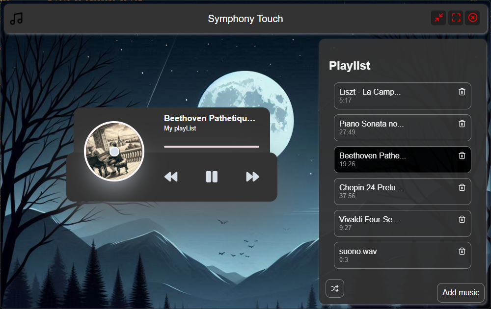

# Symphony-touch

🎶🎶🎶  
A simple music player created using Node.js. This project allows users to play local audio files, manage playlists, and control playback with functions like pause, play, and skip.
There will be both English and Italian comments in the code.

## Features

- 🎵 **Local audio playback**: Supports common audio formats like MP3, WAV, and FLAC.
- 📂 **Playlist management**: Create, edit, and save custom playlists.
- ⏯️ **Basic controls**: Play, pause, stop, skip forward and backward.
- 💻 **GUI interface**: A simple interface to control the player.

## Requirements

🖥️📦🖥️  
- 🖥️ **Node.js** (version 16 or higher)  
- 📦 **npm** (version 8 or higher)

## Installation

1. 📥 Clone the repository:

   ```bash
   git clone https://github.com/Gabry848/symphony-touch.git
   cd music-player
   ```

2. 📂 Install the dependencies:

   ```bash
   npm install
   ```

3. ▶️ Run the project:

   ```bash
   npm start
   ```

Usage
After starting the program, follow the instructions in the command line to:

 - 🎶 Load audio files or directories.
 - 📝 Create and manage playlists.
 - ⏯️ Use playback controls (play, pause, skip, etc.).

## Project structure

📂📂📂
```
player/
├── .git/
├── .gitignore
├── README.md
├── LICENSE.txt         # Licenza del progetto
├── package.json
├── package-lock.json
├── node_modules/
└── app/
    ├── main/
    │   ├── main.js
    │   ├── preload.js
    │   └── scripts/
    ├── renderer/
    │   ├── assets/
    │   ├── css/
    │   │   └── index.css
    │   ├── html/
    │   │   └── index.html
    │   └── scripts/
    │       └── renderer.js
    ├── services/
    └── shared/
        ├── costants.js
        ├── music.json
        └── settings.json
```

## Screenshot

🖼️


## Key dependencies

🎧🛠️🎧
- 🎧 **[howlerjs](https://howlerjs.com)**: For audio playback..
- 🛠️ **[electron](https://www.electronjs.org)**: To create an interactive interface

<!--## Contributi

Siamo aperti a contributi! Per aggiungere funzionalità o correggere bug:

1. 🍴 Fai un fork del repository.
2. 🌱 Crea un branch per la tua modifica:
   ```bash
   git checkout -b nome-branch
   ```
3. 📝 Fai un commit delle modifiche e apri una pull request.
-->

## License

📜📜📜
This project is licensed under the MIT license. See the [LICENSE](LICENSE.txt) file for more details

